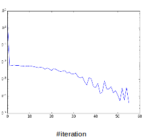

# Team 1, West Coast Low Ranked 

Anna Voevodskaya,
Ilya Gukov,
Polina Sannikova,
Anton Rykachevskiy,

## Idea & Motivation
One fundamental problem of computer vision is to recognize certain features or images in scenes. In this project our team focused on problem of recognizing and extracting regular patterns on planar surface. These patterns also can be described as "Low-Ranked matrices". Camera can deform image low-rank image by some affine or projective, so the problem is to find this tranformation, and recover low-rank structure.  

## Problem formulation.

#### Formulation

As it was mentioned above, we work with the images which after some homography transformation can be represented as a sum of the low rank matrix $A$ and a sparse error matrix $E$
 . So we can fromulate the optimization objective in the following way $$\min rk(A)+\|E\|_{0}$$
 Than we add the constraint $$\tau I=A+E$$
 where $\tau$ is the homography we are searching for and $I$ is the matrix of the original image. As it was show recently [1], this problem usually can be reformulated in the following way:

$$\begin{array}{c}
\min\|A\|_{\sigma}+\|E\|_{1}\\
\tau I=A+E
\end{array}$$

#### Summary

Our task will be to write python implementation of TILT, and try to evaluate performance.

## Data.

Actually data for this task is floating arround us every second. We used some pictures from original paper[2], and also some pics of Skoltech, chessboard, e.t.c.

## Evaluation.

#### Homography

To strart with let us precisely define the transformations we are working with. Homography is a coordinate transformation which transform lines to lines. In homogenius coordinates it can be represented as $3\times3$
  matrix. We can think of our image as of the continious function of two variables $I(x,y)$
 , where $I$
  defines intensity in target point. Let $H$
  be the matrix of homography, than we transform the coordinates in the following way 
  
  $$\left[\begin{array}{c}
x\\
y
\end{array}\right]\rightarrow\left[\begin{array}{c}
x\\
y\\
1
\end{array}\right]\rightarrow H\left[\begin{array}{c}
x\\
y\\
1
\end{array}\right]\rightarrow\left[\begin{array}{c}
u\\
v\\
s
\end{array}\right]\rightarrow\left[\begin{array}{c}
\frac{u}{s}\\
\frac{v}{s}\\
1
\end{array}\right]\rightarrow\left[\begin{array}{c}
\frac{u}{s}\\
\frac{v}{s}
\end{array}\right]$$
 And thus intensity is transformed like this $$\tau I(x,y)=I(\frac{u}{s},\frac{v}{s})$$
 Later we will need a Jacobi matrix of this transformation. 

#### Optimization

$$\begin{array}{c}
\min_{\tau,A,E}\|A\|_{\sigma}+\|E\|_{1}\\
\tau I=A+E
\end{array}$$
 

Objective is convex, but the constrains are strange. So the first idea is to linearise constraints around $\tau_{o}$
  , solve covex problem using ALM, shift tau, and repeat until convergence. So on each step of outer loop we formulate new problem:

$$\begin{array}{c}
\min_{\Delta\tau,A,E}\|A\|_{\sigma}+\|E\|_{1}\\
\tau_{0} I+\nabla I_{\tau}\Delta\tau=A+E
\end{array}$$
 

This problem is solved using augmented lagrangian. 

$$L=\|A\|_{\sigma}+\|E\|_{1}+\left\langle Y,C\right\rangle +\frac{\mu}{2}\|C\|_{F}^{2}$$
 where $C=\tau_{0} I+\nabla I_{\tau}\Delta\tau-A-E$
 

Basic iteration looks like this:

$$\begin{array}{c}
A_{k},E_{k},\Delta\tau_{k}=argminL(Y=Y_{k-1})\\
Y_{k}=Y_{k-1}-\mu_{k-1}C_{k}\\
\mu_{k+1}=\rho\mu_{k}
\end{array}$$
 

And the first minimization is solved one by one for each variable. 

Figure 1, is from original paper [2], describes algorithm in details. 

A little bit more attention should be payed to how we linearize, we need to calculate $\nabla_{\tau}I$
 , where $\tau$
  should be considered as a parametres of transformation. We calculate it the following way:

$$\nabla_{\tau}I=\frac{\partial}{\partial\tau_{i}}I(x,y)=\frac{\partial}{\partial\tau_{i}}I(H(\tau)(u,v))=\frac{\partial I}{\partial u}\frac{\partial u}{\partial\tau_{i}}+\frac{\partial I}{\partial v}\frac{\partial v}{\partial\tau_{i}}$$
 

#### Additional improvments

First of all we use kind of branch and bound approach to define best initial transformation. We initialize few different rotation matrixes, apply corresponding transformations to the images, calculate the objective, and choose the one which has lowest objective. We do the same for a set of shift matrix, and set initial matrix as a multiplication of choosen shifts and rotates. 

The second idea is to blur image before processing, this makes structures “more low ranked”, for example text becomes more low ranked, after bluring. 

The last idea is to use pyramid approach. To proceed resized image first and than use transformation we obtained as initial for the whole sized picture. This works well, especcially if we need to proceed large images. 

## Related work

The list of related articles can be found in literature. Actually this exact algorithm was realised on matlab by Visual Computing Group, Microsoft Research Asia, Beijing and Coordinated Science Lab, University of Illinois at Urbana-Champaign [2]. Also some job was done to recover the shapes of cilindrical objects with low ranked structers on them[3]

## Our results

#### Code

Working code of TILT on python can be found here https://github.com/AntonRykachevskiy/pytilt

When you run the code, the picture you have loaded appears, and you have to click on the upper left point of the lowranked region, and close the picture, it appears again and you click on the bottom right corner, and close it again. After some time program will produce a result

#### How it looks
Here some of our results. Purple is original window set by the user, yellow is a window with low ranked texture, which after transformation will be in the coordinates of original. 

Also we can transform the original image after we found transformation. *here we should be carefull because the  transformaton center is in the center of the region, user have chosen, so we need to shift the coordinates, and than shift them back.

Transform, some part on the right is lost, because of choosen frame size

#### Performance

First of let's see how algorithm without pyramid, blur and branch-and-bound works. Some times it fails to converge to what we expect, and converges to some local minimum, even on quite small error tollerance. 

 

For some pictures it can be solved appliying blur to image.

We didn't see any convergence failtures when we applied branch-and-bound, cause it usually finds rather good initial approximation. 

#### Features

Some times we can apply algorithm to pictures which are not actually lowranked, but have at least some symmetry. For example we can rotate faces. 

Also we made an experimet with video generating. Which is on a github

#### Difficulties and solutions

We faced a lot of troubles with correct image processing on python. The main difficulty was that openCV image transformation routines are able to loose information about image if after transformation it goes otside the frame. To solve this, we wrote a few routines, which shift coordinates by multiplying transformation matrix to special shift matrix, and resize image frame so the significant information is not lost. 

On the other hand we succesfully splited the work and were able to finish few hours before the deadline. 

Now we have fully working open source code on python which (maybe after little cleaning) can be applied, and improved for further tasks. 

## Team

##### West coast low ranked! 

Anna Voevodskaya
Iluya Gukov
Polina Sannikova
Anton Rykachevskiy

Jobsplit was approximatly the following:

#### Anna Voevodskaya:
- Project idea
- Initial literature research
- Branch-and-bound
- Presentation preparing
- Performance

#### Ilya Gukov:
- Main iteration cycle
- Jacobian
- Branch-and-Bound 
- Additional routines

#### Polina Sannikova
- Main iteration cycle
- Inner ALM (inner cycle)
- Theory 
- Image transformations
- Blur
- Interface
- Additional routines

#### Anton Rykachevskiy
- Branch-and-Bound
- Pyramid
- Theory
- Image tranformations
- Debug
- Team managment
- Final report and presentation performance

## Literature and resources 

[1] Candes, E., Li, X., Ma, Y., Wright, J.: Robust principal component analysis preprint (2009)

[2] Zhengdong Zhang y , Xiao Liang y , Arvind Ganesh z , and Yi Ma: TILT: Transform Invariant Low-rank Textures.

[3] Zihan Zhou, Allen Y. Yan and Yi Ma: Holistic 3D Reconstruction of Urban Structures from Low-Rank Textures
Hossein Mobahi

