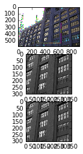
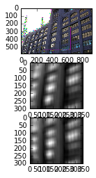
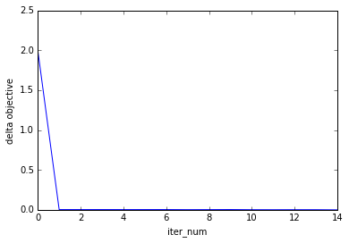
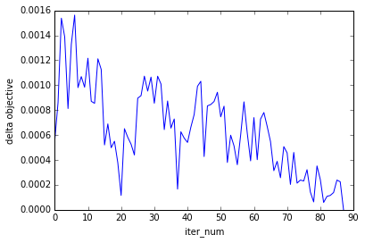
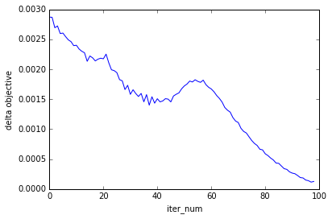
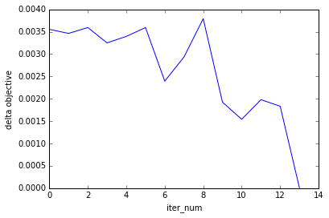

# Team 1, West Coast Low Ranked 

Anna Voevodskaya,
Ilya Gukov,
Polina Sannikova,
Anton Rykachevskiy

## Idea & Motivation
One fundamental problem of computer vision is to recognize certain features or images in scenes. In this project our team focused on problem of recognizing and extracting regular patterns on planar surface. These patterns also can be described as Low-Ranked matrices. Camera can deform low-rank image with some affine or projective transformation, so the problem is to find this tranformation, and recover low-rank structure.  

## Problem formulation.

#### Formulation

As it was mentioned above, we work with the images which after some homography transformation can be represented as a sum of the low rank matrix $A$ and a sparse error matrix $E$
 . So we can fromulate the optimization objective in the following way $$\min rk(A)+\|E\|_{0}$$
 Than we add the constraint $$\tau I=A+E$$
 where $\tau$ is the homography we are searching for and $I$ is the matrix of the original image. As it was show recently [1], this problem usually can be reformulated in the following way:

$$\begin{array}{c}
\min\|A\|_{\sigma}+\|E\|_{1}\\
\tau I=A+E
\end{array}$$

#### Summary

Our task will be to write python implementation of TILT, and evaluate performance.

## Data.

Actually data for this task is floating arround us every second. We used some pictures from original paper[2], and also some pics of Skoltech, chessboards, e.t.c.

## Evaluation.

#### Homography

To strart with let us precisely define the transformations we are working with. Homography is a coordinate transformation which transform straght lines to straight lines. In homogenous coordinates it can be represented as $3\times3$
  matrix. We can think of our image as of the continious function of two variables $I(x,y)$
 , where $I$
  defines intensity in target point. Let $H$
  be the matrix of homography, than we transform the coordinates in the following way 
  
  $$\left[\begin{array}{c}
x\\
y
\end{array}\right]\rightarrow\left[\begin{array}{c}
x\\
y\\
1
\end{array}\right]\rightarrow H\left[\begin{array}{c}
x\\
y\\
1
\end{array}\right]\rightarrow\left[\begin{array}{c}
u\\
v\\
s
\end{array}\right]\rightarrow\left[\begin{array}{c}
\frac{u}{s}\\
\frac{v}{s}\\
1
\end{array}\right]\rightarrow\left[\begin{array}{c}
\frac{u}{s}\\
\frac{v}{s}
\end{array}\right]$$
 And thus intensity is transformed like this $$\tau I(x,y)=I(\frac{u}{s},\frac{v}{s})$$
 Later we will need a Jacobi matrix of this transformation. 

#### Optimization

$$\begin{array}{c}
\min_{\tau,A,E}\|A\|_{\sigma}+\|E\|_{1}\\
\tau I=A+E
\end{array}$$
 

Objective is convex, but the constrains are strange. So the first idea is to linearise constraints around $\tau_{o}$
  , than solve covex problem using Augmented Lagrangian Method(ALM), shift tau, and repeat until convergence. So on each step of outer loop we formulate new problem:

$$\begin{array}{c}
\min_{\Delta\tau,A,E}\|A\|_{\sigma}+\|E\|_{1}\\
\tau_{0} I+\nabla I_{\tau}\Delta\tau=A+E
\end{array}$$
 
Where in $\nabla_{\tau}I$, $\tau$ should be considered as a parametres of transformation. We calculate gradient by this parametres the following way:

$$\nabla_{\tau}I=\frac{\partial}{\partial\tau_{i}}I(x,y)=\frac{\partial}{\partial\tau_{i}}I(H(\tau)(u,v))=\frac{\partial I}{\partial u}\frac{\partial u}{\partial\tau_{i}}+\frac{\partial I}{\partial v}\frac{\partial v}{\partial\tau_{i}}$$

This problem is solved using augmented lagrangian. 

$$L=\|A\|_{\sigma}+\|E\|_{1}+\left\langle Y,C\right\rangle +\frac{\mu}{2}\|C\|_{F}^{2}$$
 where $C=\tau_{0} I+\nabla I_{\tau}\Delta\tau-A-E$
 

Basic iteration looks like this:

$$\begin{array}{c}
A_{k},E_{k},\Delta\tau_{k}=argminL(Y=Y_{k-1})\\
Y_{k}=Y_{k-1}-\mu_{k-1}C_{k}\\
\mu_{k+1}=\rho\mu_{k}
\end{array}$$
 

And the first minimization is solved one by one for each variable. 

Figure 1, is from original paper [2], describes algorithm in details. 

 

#### Additional improvments

#### Branch and Bound

As it will be shown later in the report, sometimes we converge to local minimum. To avoid this we use kind of branch and bound approach to define best initial transformation. 

At first step we initialize 5 rotation matrixes with different angles $t$ from zero to $\pi / 3$

$$\left[\begin{array}{ccc}
cos(t) & -sin(t) & 0\\
sin(t) & cos(t) & 0\\
0 & 0 & 1
\end{array}\right]$$
 
and apply these matrixes to original image. 
For each transformation we calculate objective, and choose that rotation matrix wich gives the smallest.

Than we initialize set of horizontal affine skews with the parameter $t$, which make from original square segmet parallelogram segment.

$$\left[\begin{array}{ccc}
1 & t & 0\\
0 & 1 & 0\\
0 & 0 & 1
\end{array}\right]$$

We apply them to rotated image, and again we chose the best one.

Afterwrds we do the same for vertical skew 

$$\left[\begin{array}{ccc}
1 & 0 & 0\\
t & 1 & 0\\
0 & 0 & 1
\end{array}\right]$$

Than, finally, we set initial matrix like multiplication of all these three

$$I = \left[\begin{array}{ccc}
1 & 0 & 0\\
t_3 & 1 & 0\\
0 & 0 & 1
\end{array}\right]\left[\begin{array}{ccc}
1 & t_2 & 0\\
0 & 1 & 0\\
0 & 0 & 1
\end{array}\right]\left[\begin{array}{ccc}
cos(t_1) & -sin(t_1) & 0\\
sin(t_1) & cos(t_1) & 0\\
0 & 0 & 1
\end{array}\right]$$

Here $t_1, t_2$ and $t_3$ denotes best parameters on each of the steps.

#### Blur
The second idea is to blur image before processing, this makes structures “more low ranked”, for example text becomes more low ranked, after bluring. As you can see in performance section, this some time helps to find global minimum instead of local one.

#### Pyramid

The last idea is to use pyramid approach. 
We take initial image and scale it down in $2^k$ times, where $k$ is some predefined parameter. Than we find correct transformation for this small image $\tau_{k}$. Than we take initial image and scale it down in $2^{k-1}$ times, we set initial transformation as $\tau_{k}$, and thus search around it. And so on till we find transformation for original image.

As you will see in performance section this significantly reduces evaluation time, and some time tends to find global optimum instead of local one. 

## Related work

The list of related articles can be found in literature. Actually this exact algorithm was realised on matlab by Visual Computing Group, Microsoft Research Asia, Beijing and Coordinated Science Lab, University of Illinois at Urbana-Champaign [2]. Also some job was done to recover the shapes of cilindrical objects with low ranked structers on them[3]

## Our results

#### Code

Working code of TILT on python can be found here https://github.com/AntonRykachevskiy/pytilt

When you run the code, the picture you have loaded appears, and you have to click on the upper left point of the lowranked region, and close the picture, it appears again and you click on the bottom right corner, and close it again. After some time program will produce a result

#### How it looks
Here some of our results. Purple is original window set by the user, yellow is a window with low ranked texture, which after transformation will be in the coordinates of original. 

{#id .class width=600 height=200px}

## Performance 

#### Here is the part of the picture we will use to evaluate performance

#### Setup
Tollerance and maximum iter will be the same for all tests
In the outer iteration cycle, where we linearize constriants we set
error_tol = 1e-6, 
max_iter = 100.
In the inner cycle, where we calculate matrix decompositions we set
error_tol = 1e-4,
max_iter = 100,

Note that we set inner cycle tollerance larger than outer cycle tollerance, in this case we will unlikely brake out of the outer cycle by tollerance, but we will plot outer cycle error on each step, so we will see if we are in the minimum

For each expiriment top picture is initial, middle picture is the one after initial transformation, bottom one is the final picture.

\pagebreak

#### First experiment 
First we run the test with blur, pyramid and branch-and-bound turned off

\ {#id .class width=303 height=200px}

Wall time: 3min 9s

As one can see it takes enourmouse time, and we converge in local optimum! 

\pagebreak

#### Second experiment
Now we turn the blur on and see what happens

\ {#id .class width=303 height=200px}

Wall time: 3min 36s

It almoust the same time consuming, but we can see that the verticals on the image became verticals. This means that the nearest local minimum is in the better point for blured image. The convergence goes the same way, it take around 60 outer iterations.

\pagebreak

#### Third experiment 
We now set the pyramid on

\ {#id .class width=303 height=200px}

Wall time: 17.1 s

What we see now is that the time decreased more than in 10 times. And we converge to local optimum in less than 20 iterations. In fact we converge in local optimum on the first few iterations, because we started from transformation, which was found for the same image which size was decreased in 4 times.

\pagebreak

#### Fourth experiment 
Now we add branch-and-bound

\ {#id .class width=303 height=200px}

Wall time: 18.1 s

Here we see global optimum which we expected, and time spent is almoust the same as for pyramid

\pagebreak

#### N-th expiriment

If we set outer_tollerance to $5*$inner_tollerance, and turn all the euristics on, we get the convergence on the first step, and time taken decreases twice

\ {#id .class width=303 height=200px}

Wall time: 6.07 s

\pagebreak

#### N+1-th experiment

Now we leave the errors like in previous and turn off pyramid and blur

\ {#id .class width=303 height=200px}

Wall time: 3min 14s

We see extreme time growth, but what's more important we are in the local optimum again

\pagebreak

#### N+2-th experiment
To get back to the global optimum we can try to add blur

\ {#id .class width=303 height=200px}

Wall time: 4min 20s

Yes! Global optimum on the last picture. 

\pagebreak

#### N+3-th Experiment
We try pyramid + branch and bound configuration

\ {#id .class width=303 height=200px}

Wall time: 5.89 s

Perfect, fast global minimum. This is what we sometimes can expect, because smaller picture actually looks like blured large.

#### Summary

$$\begin{array}{ccccc}
Blur & Pyramid & B\&B & Minimum & Time\\
off & off & off & Local & Huge\\
on & off & off & Better\ Local & Huge\\
on & on & off & Better\ Local & Small\\
on & on & on & Global & Small\\
off & off & on & Local & Huge\\
on & off & on & Global & Small\\
off & on & on & Global & Small
\end{array}$$
 

#### Features

Some times we can apply algorithm to pictures which are not actually lowranked, but have at least some symmetry. For example we can rotate faces. 

Also we made an experimet with video generating, where we put moving text on perspective photo of Skoltech building.
First we find correct transformation, than we transform the perspective photo to flat one. Than we add frames with text, and finally transform every frame in the inverse way.

{#id .class width=300 height=550px}

Some part on the right is lost, because of choosen frame size

{#id .class width=250 height=250px}

Video can be found here https://vk.com/video1679382_456239026

Funny thing on this exact picture is that we got the photo of frontage, without lighter which stands in front of the building! 

#### Difficulties and solutions

We faced a lot of troubles with correct image processing on python. The main difficulty was that openCV image transformation routines are able to lose information about image if after transformation it goes otside the frame. To solve this, we wrote a few routines, which shift coordinates by multiplying transformation matrix to special shift matrix, and resize image frame so the significant information is not lost. 

On the other hand we succesfully splited the work and were able to finish few hours before the deadline. 

Now we have fully working open source code on python which (maybe after little cleaning) can be applied and improved for further tasks. 

## Team

#### West coast low ranked! 

Anna Voevodskaya,
Ilya Gukov,
Polina Sannikova,
Anton Rykachevskiy

Jobsplit was approximatly the following:

#### Anna Voevodskaya:
- Project idea
- Initial literature research
- Branch-and-bound
- Presentation preparing
- Performance
- Stop criterium
- Debug

#### Ilya Gukov:
- Main iteration cycle
- Jacobian
- Branch-and-Bound 
- Additional routines

#### Polina Sannikova
- Main iteration cycle
- Inner ALM (inner cycle)
- Theory 
- Image transformations
- Blur
- Interface
- Additional routines
- Performance

#### Anton Rykachevskiy
- Branch-and-Bound
- Pyramid
- Theory
- Image tranformations
- Debug
- Performance
- Team managment
- Final report and presentation performance

## Literature and resources 

[1] Candes, E., Li, X., Ma, Y., Wright, J.: Robust principal component analysis preprint (2009)

[2] Zhengdong Zhang y , Xiao Liang y , Arvind Ganesh z , and Yi Ma: TILT: Transform Invariant Low-rank Textures.

[3] Zihan Zhou, Allen Y. Yan and Yi Ma: Holistic 3D Reconstruction of Urban Structures from Low-Rank Textures
Hossein Mobahi

